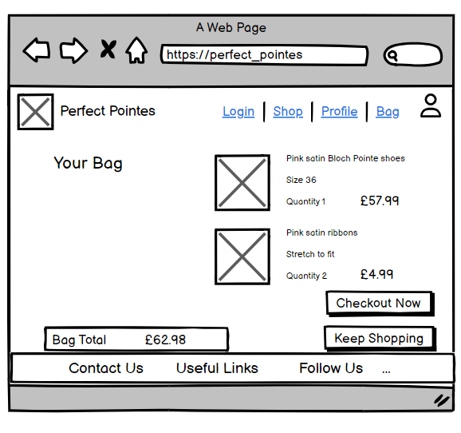
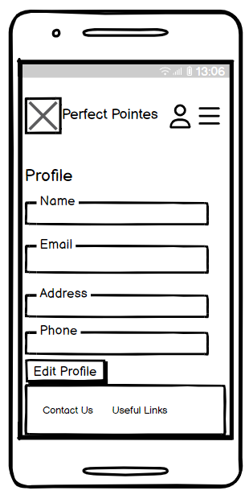
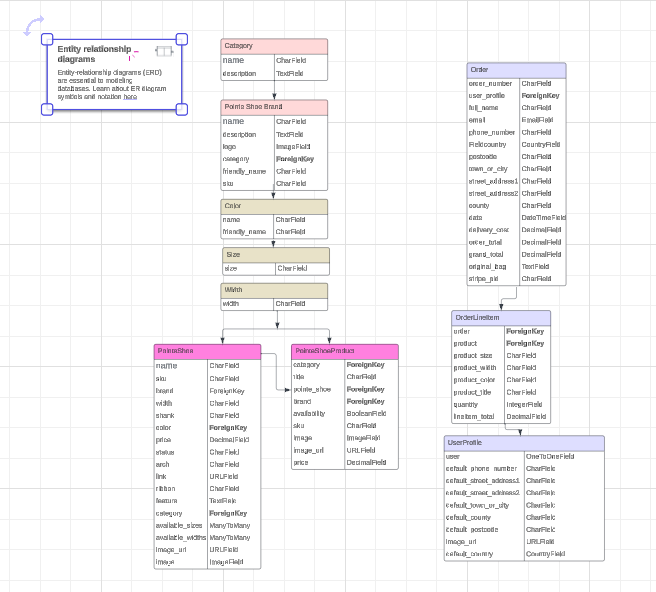
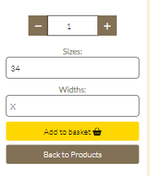
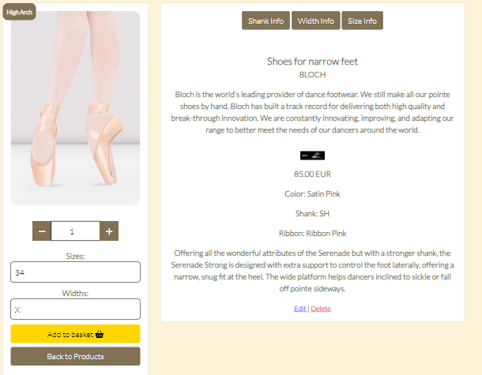
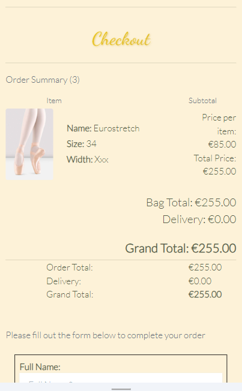
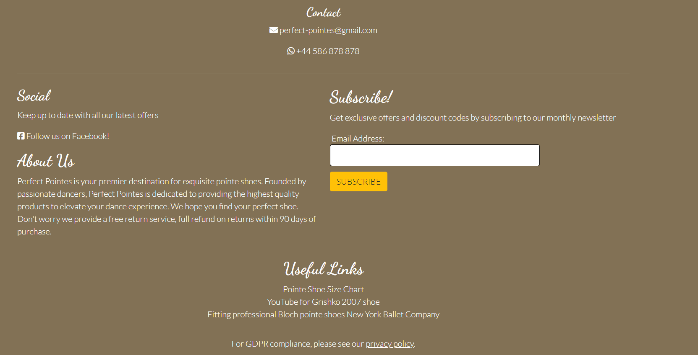

# Perfect Pointes

The Perfect Pointes project is a B2C e-commerce application which sells pointe shoes directly to ballet dancers, both the professional and the aspiring dancer. The site aims to present users with an attractive and intuitive online shopping experience and encourage return visits through features such as a newsletter, social media posts, and an easy to use user profile function to save customer details and a repurchase button to quickly buy the product again. The store aims to provide a wide variety of fit and functionality, to give the customer as much information as possible to make an informed decision about the pointe shoe they will purchase.

The site is implemented as a retail store where users can view, search and filter the pointe shoes on offer, then select items to add to their shopping bag and purchase through a secure single payment.
General users can purchase pointe shoe products without registering with the site, but are given the chance to save their delivery details and therefore their orders at the checkout page if they so wish.

Admin users can manage the pointe shoe products. They can update pricing, links to products, pointe shoes on offer, images and product information. They can select if a pointe shoe size and width is in-stock, so that only available shoes are listed on the site.

Other considerations for an e-commerce B2C site.

    - Web Marketing strategies:
        - Organic Social - through facebook
        - Email - through a newsletter subscription managed via Mailchimp

The structure and purpose of the Perfect Pointes project is based on the Code Institute Boutique Ado walkthrough project as part of Portfolio 5 of The Code Institute course.

The functionality of the purchasing process is featured below.

## Portfolio Project 5

P5 Project for the Code Institute

[Live Site](https://perfect-pointes-d5136a797ac1.herokuapp.com/)

[Website Mock-up](https://ui.dev/amiresponsive?url=https://perfect-pointes-d5136a797ac1.herokuapp.com/)

## Table of contents

- [UX Design](#ux-design)
- [User Stories](#user-stories)
- [Features](#features)
- [Future Features](#future-features)
- [Languages Used](#languages-used)
- [Frameworks, Libraries and Programs Used](#frameworks-libraries-and-programs-used)
- [Marketing and SEO README.md](#marketing-and-seo-readmemd)
- [Testing README.md](#testing-readmemd)
- [Technologies Used](#technologies-used)
- [Deployment and Publishing](#deployment-and-publishing)
- [Resources](#resources)
- [Credits](#credits)
- [Acknowledgements](#acknowledgements)

# UX Design

For a pointe shoe e-commerce website, understanding user needs is crucial for providing a satisfying and effective shopping experience. Here are some user needs that this type of website aims to address:

1. Product Information and Variety:

Accurate Details: Users need comprehensive information about pointe shoes, including materials, sizes and fitting guides.

Variety: Cater to different levels of dancers, offering options suitable for beginners, intermediate, and professional dancers.

2. Ease of Navigation and Search:

Intuitive Interface: Users need an easy-to-navigate website with clear categorisation and filtering options to find the right shoes efficiently.

Search Functionality: A robust search bar with filters for brand, size, style, and level to help users find specific products quickly.

3. Reliable and Secure Shopping:

Trustworthiness: Users need assurance of secure transactions and protection of personal information.

4. User Experience and Convenience:

Mobile Compatibility: With a growing number of users shopping via mobile devices, the site should be mobile-friendly.

Personalisation: recommended products in the categories and saved preferences enhance the shopping experience.

5. Customer Support and Assistance:

Responsive Support: Access to customer service via email, or phone helps address queries, sizing concerns, or technical issues.

Sizing Guidance: Providing accurate sizing charts or tools helps users choose the right fit.

6. Educational Content:

Guides and Resources: Articles, videos, or guides about proper fitting, care, and maintenance of pointe shoes are valuable to users.

__Colours:__

Image of the colour palette

Soft Pastel Shades: Light and delicate colours like pale pinks evoke a sense of elegance and femininity associated with ballet.

Neutral Tones: Beige, ivory, or light taupe can complement the pastels and provide a clean, neutral backdrop, allowing the shoes to stand out.

Accent Colours: Subtle accents of gold, silver, or metallic shades can add sophistication without overpowering the overall design.

Site-wide alert: Gold #ffc107

Overlay of black and white landing image: Pink rgba(234, 172, 157, 0.7)

Ribbon: Pink #e6846c

Custom button: Brown #827155

Shiny button effect: rgba(255, 255, 255, 0.8), rgba(255, 255, 255, 0) rgba(234, 172, 157, 0.7)

Gold font: linear-gradient(45deg, #ffd700, #d4af37)

Gold container frame: #f1e0b7

__Fonts:__

Sans-Serif Font Lato: For body text and readability, a clean and modern sans-serif font Lato used for a contemporary look.

Cursive or Script Fonts: Dancing Script for headings or decorative elements, to add a touch of elegance.

Heading and Body Text Font Pairing:

    - Dancing Script for headings with a sans-serif font. 
    - Lato for body text to create a contrast that enhances readability while maintaining an elegant feel.

__Accessibility aims:__

The fonts and colours were chosen to meet accessibility standards for readability and contrast, especially for users with visual impairments.

The aim is to maintain consistency in font styles and colours throughout the website for a cohesive and professional appearance.

__Wireframes__

- Homepage

- Products View

- Product detail

- Shopping bag view

- Checkout view

- User profile page

- About Us page

- Entity-Relationship diagram for DBMS

Made in Lucidchart.

__Notes on the ER diagram:__

- Entities:

 - Category: Represents different categories for pointe shoes.

 - PointeShoeBrand: Brands manufacturing pointe shoes.

 - Size: Various sizes available for pointe shoes.

 - Width: Different width options for pointe shoes.

 - Colour: Various colours available for pointe shoes.

 - PointeShoe: Represents different models or types of pointe shoes.

 - PointeShoeProduct: Instances of pointe shoes available for purchase.

 - Order: Represents an order made by a user.

 - OrderLineItem: Represents individual items within an order.

 - UserProfile: Profiles associated with each user.

- Relationships:

 - Category - PointeShoeBrand: One-to-many (A category can have multiple pointe shoe brands).

 - Category - PointeShoe: One-to-many (A category can have multiple pointe shoe models).

 - Color - PointeShoe: Many-to-one (A colour can be associated with multiple pointe shoe models).

 - Size - PointeShoe: Many-to-many (A pointe shoe can have multiple available sizes, and a size can be associated with multiple pointe shoes).

 - Width - PointeShoe: Many-to-many (A pointe shoe can have multiple available widths, and a width can be associated with multiple pointe shoes).

 - PointeShoeBrand - PointeShoe: One-to-many (A brand can have multiple pointe shoe models).

 - PointeShoe - PointeShoeProduct: One-to-many (A pointe shoe model can have multiple instances available for purchase).

 - UserProfile - Order: One-to-many (A user can have multiple orders).

 - Order - OrderLineItem: One-to-many (An order can have multiple line items).

- Attribute Inheritance:
 - PointeShoeProduct inherits attributes from PointeShoe and PointeShoeBrand. 

# User stories :

### Registration and Account Management

- US1 : Register for an account
    - As a site user I can register for an account so that I can view my profile and purchasing history.

- US2 : Login and logout
    - As a site user I can easily login or logout so that I can access my personal account information.

- US3 : Access user profile
    - As a site user I can access my personalised user profile so that I can view my personal order history and order confirmations and my payment information.

### Viewing and Navigation

- US4 : View a list of pointe shoe products
    - As a site user I can view a list of pointe shoes so that I can select some to purchase.

- US5 : View individual pointe shoe details
    - As a site user I can view details for a pointe shoe so that I can see the description, brand logo, brand information, available sizes, available widths, shank, suitability of product beginner, intermediate, advanced dancer, product colour, product features and pricing.

- US6 : View shopping bag total
    - As a site user I can easily view the total of my purchases at any time to monitor my spending.

- US7 : Easily understand the purpose of the website and how to navigate it.
    - As a site user I can quickly identify what the website is selling and easily navigate to the pages so that I can quickly find the information and functionality of the pointe shoe product I require.

- US8 : View pointe shoes by category
    - As a site user I can view a specific category of pointe shoes so that I can quickly narrow down the available shoes that I am interested in.

- US9 : View pointe shoe feature
    - As a site user I can view pointe shoe features so that I can easily find the shoe that is best suited to my dance level and foot shape.

- US10 : Handle 404 and 500
    - As a site user I can return to continue shopping after http 404 and 500 response so that I feel I am still working within the website and can navigate easily.

### Sorting and Searching

- US11 : Sort list of available pointe shoes
    - As a site user I can sort the list of pointe shoes products so that I can easily identify the most suitable shoe categorically sorted by colour, price, brand and category.

- US12 : Search for a pointe shoe by title or feature
    - As a site user I can search for shoes by title or pointe shoe feature so that I can find a specific pointe shoe to purchase.

### Purchasing and Checkout

- US13 : Add items to shopping bag
    - As a site user I can add items to my shopping bag so that I can choose multiple items to purchase.

- US14 : Modify bag contents and remove items.
    - As a site user I can modify shopping bag quantities and remove items from the bag so that I can manage the contents and modify any items selected by mistake.

- US15 : View notifications of user interactions
    - As a site user I can get notifications on screen of my actions so that I can easily understand my interactions during the purchasing process.

- US16 : Finalise my order in the checkout page
    - As a site user I can complete my order by going through to the checkout page so that I can see a final total, a summary of my order and I can specify a delivery address and payment details.

- US17 : Implement a secure payment process.
    - As a site user I can enter my payment details so that my payment is secure.

- US18 : View an order confirmation after checkout and repurchase product
    - As a site user I can view an order confirmation after checkout so that I can see what was ordered and total costs. I can repurchase the product by clicking on the button which takes the user to the relevant product detail page.

- US19 : Receive an email confirmation after checking out.
    -  As a site user I can receive an email confirmation after checking out so that I have a record of my purchases.

### Admin and Store Management

- US20 : Add a pointe shoe
    - As a site admin I can add a pointe shoe so that I can sell new products.

- US21 : Edit / update a pointe shoe
    - As a site admin I can edit / update details for a pointe shoe so that I can change or amend the title, image, brand, colour, availability of size and width, status and features.

- US22 : Delete a pointe shoe
    - As a site admin I can delete a product so that I can remove the item for sale.

### SEO and Web Marketing

- US23 : Subscribe to newsletter
    - As a site user I can subscribe to the company newsletter so that I can keep up with company news and offers.

- US24 : View company facebook page
    - As a site user I can find the company on facebook so that I can keep up to date with company posts.

- US25 : View privacy policy
    - As a site user I can view the company privacy policy so that I can see the company is GDPR compliant.

# Features

Below are descriptions of the main features of the application. Many of the features are based on the Boutique Ado walkthrough project and SEO and Web Marketing modules of the course.

Perfect Pointes uses a B2C e-commerce model, selling directly to end customers with single online payments to cover purchases.

The page layout, navigation bar, header, footer, colours and fonts have a consistent look and feel on all pages of the website to give the user an intuitive easy to use experience. The navigation bar is responsive on multiple screen sizes - on smaller screens it converts to a 'burger' menu style.

- Landing page 

- Logo

- Navbar

Navbar - mobile view - hamburger for a visual cue

Users receive a more streamlined experience so that they don't get overwhelmed and leave. 

Navbar - Signup/Login shows instead of Logout if user is not logged in. If user is logged in, the navbar displays a "Welcome" message.

Staff option for Product Management available logged-in staff member registered as superusers - they receive a dropdown that allows for adding and editing pointe shoe products. When adding a new product the form alerts the admin if the SKU is already in use so that the new product can be added successfully.

 

Shop navigation - Available brands and available categories

 

Search Option

 

Bag total

 

Login/Sign-up/Sign out

 

 

 

- Products Page

Bootstrap card layout changes responsively based on the screen size.
There is an image of each pointe shoe. Or an alternative "no-image.jpg" displayed.

Alternative image: no image available image

 

Filter by brand, category, price and colour

Image: pointe shoe image with shoe suitability by arch (Low, Medium, High). 

Bow detail to show the shoe suitability for beginner, intermediate and advanced dancers

 

If logged in as a superuser the option to edit or delete a product

 

- Product Detail Page

Popover: details of widths, shanks and sizes information, so the user can make an informed product selection. 

 

Dropdowns: variables such as width and size with their available options.

 

 

Profile Page

 

Brand: information and logo (if added by the admin)

Shoe status: Beginner, Intermediate or Advanced - based on dancers ability and suitability.

Feature: further information about the pointe shoe.

Quantity selector.

Add to bag button.

Continue shopping button.

- Shopping Bag

 

 

Ability for the user to check details and then add quantity to the bag if they are happy with the product and price.

Option for the user to update the number of products, or remove products. Product details and subtotal are shown.

On larger viewports there is a thumbnail image of the product shown.

- Checkout

 

 

Summary of products, total of products, personal details and option to save details or create an account. On larger viewports there is a thumbnail image of the product shown.

Form to enter personal and delivery details.

Register to save details, based on active user status. 

- This feature helps customers to save the order so that they can keep a record of the pointe shoe that is perfect for them. 
 

Stripe payments
Payment element with clear indication of how much will be charged. Webhooks connected.
Webhook and stripe payments image

 

- Checkout Success

 

Details of product that has just been ordered, including size, shoe title, width and quantity.

Option to repurchase the product again

Pointe shoes last between 6-9 months and need to be regularly repurchased, this option makes it easy for customers.

 

- User profile

Ability to see past orders and delivery information, ability to edit delivery information.

Able to click through and check individual orders. 

- Privacy Policy - assures users that the site is trustworthy and can be used safely.

 

 

- Footer with Mailchimp signup, links to static pages and facebook page. 

- About us section with returns information. 
- Links to YouTube and official pointe shoe websites for fitting guide and interesting pointe shoe videos.

Error pages - 403, 404, 405 and 500 - each with an informative message and 'Keep shopping' option to guide users to the store.

 

# Future Features

- Ability for staff to add pointe shoe brands, colours, sizes and widths as well as products.

- Wishlist function for the user to add to their profile so they can shop at a later date.

- Promotion and discount codes to add further incentive to purchase from this e-commerce website.

- Loyalty programme to offer further value to the user.

- User Reviews that give genuine customer reviews to assist in decision-making and build credibility for the pointe shoe products.

- Social Validation by sharing success stories or testimonials from professional dancers to add credibility to the quality of the shoes.

# Marketing and SEO README.md

[Link to Marketing and SEO README.md](SEO_MKTG_README.md)

# Testing README.md

[Link Testing README.md](TESTING_README.md)

# Technologies Used

### Languages Used

- HTML5
- CSS3
- Jquery
- Python

# Frameworks, Libraries and Programs Used

- [Google Fonts](https://fonts.google.com/) used for the Lato and Dancing Script fonts.
- [Font Awesome](https://fontawesome.com/) was used to add icons for aesthetic and UX purposes.
- [Git](https://git-scm.com/) was used for version control by utilising the Gitpod terminal to commit to Git and Push to GitHub.
- [GitHub](https://github.com/)  is used as the repository for the project code after being pushed from Git.
- [Django](https://www.djangoproject.com/) was used as the framework to support rapid and secure development of the application.
- [Bootstrap](https://getbootstrap.com/) was used to build responsive web pages
- [Django allauth](https://django-allauth.readthedocs.io/en/latest/index.html) used for account registration and authentication
- [Pillow](https://pillow.readthedocs.io/en/stable/index.html) Python Imaging Library used for image handling
- [jquery library](https://code.jquery.com/jquery-3.4.1.min.js) for various pieces of functionality including adding and removing items from the shopping cart and handling the increment and decrement of products.
- [Django crispy forms](https://django-crispy-forms.readthedocs.io/en/latest/) used to simplify form rendering.
- [Stripe](https://js.stripe.com/v3/ used for secure payments).
- [Stripe install library](https://pypi.org/project/stripe/) used for secure payments.
- [Django Countries](https://pypi.org/project/django-countries/) used on checkout page to pass valid country code to Stripe.
- [Gunicorn](https://gunicorn.org/) was used as the Web Server to run Django on Heroku.
- [dj_database_url](https://pypi.org/project/dj-database-url/) library used to allow database urls to connect to the postgres db.
- [psycopg2](https://pypi.org/project/psycopg2/) database adapter used to support the connection to the postgres db.
- [Amazon S3](https://aws.amazon.com/s3/) used to store static files and images.
- [Boto3](https://pypi.org/project/boto3/) the Amazon Web Services (AWS) Software Development Kit (SDK) for Python.
- [django_storages](https://django-storages.readthedocs.io/en/latest/) used to connect django to S3.
- [Heroku](https://www.heroku.com/) used to host the deployed application.
- [Elephant SQL](9https://api.elephantsql.com/) SQL database service used to store models and data.
- [Lucid chart](https://lucid.app/) was used to create the Entity Relationship diagrams for the application data model
- [Balsamiq](https://balsamiq.com/) was used to create the wireframes during the design process.
- [Codeanywhere](https://app.codeanywhere.com/) IDE for the project.
- [GitPod](https://gitpod.io/) IDE used to complete the project.

# Deployment and Publishing

__GitHub__

- Forking and Cloning
To work on your own copy of the code, follow these steps for forking and cloning via GitHub:
In the repository, locate the 'Fork' button at the top right-hand side, adjacent to 'Star'. Click on it to create a new repository, forked from the original.

- To clone the repository, you have two options:
Within the repository, click on the 'Code' dropdown located next to 'Add File' on the right (underneath the Settings tab). From there, choose the option to download all files and save a local copy.
Alternatively, within the same 'Code' dropdown, opt to open the code with GitHub Desktop and proceed with your work from there.

- Elephant SQL
Setting up your ElephantSQL Database
- Sign in or sign up to an ElephantSQL account. Sign up at [Elephant SQL](https://www.elephantsql.com/) 
Once logged in, click the "Create new instance" button to create a new PostgreSQL database instance.
Choose a plan that suits your needs (e.g., Free Tiny Turtle or any other plan).
Select a region and a name for your database instance.
Click "Create ElephantSQL" to create your database instance.
- After your database instance is created, you'll receive a connection string. Copy this string as it will be required to connect to your database.

__Heroku__

- Sign in to Heroku at [Heroku](https://heroku.com), or create an account if necessary.
From the Heroku dashboard, click on the "Create new app" button. If you're using a new account, you'll see an icon to create an app on the screen. Otherwise, locate the "Create new app" function under the "New" dropdown menu at the top right corner of the screen.
On the "Create New App" page, provide a unique name for your application and select the desired region. Then, click "Create app."
Once the new app is created, navigate to the "Resources" tab in the Application Configuration page.
In the Add-ons search bar, type "Postgres" and select "Heroku Postgres" from the list. Click the "Submit Order Form" button on the pop-up dialog.
- Next, go to "Settings" on the Application Configuration page and click on the "Reveal Config Vars" button. Ensure that the DATABASE_URL has been automatically set up.
Add a new Config Var called DISABLE_COLLECTSTATIC and assign it a value of 1.
Add another new Config Var called SECRET_KEY and assign it a value - any random string of letters, digits, and symbols.
- Update the settings.py file to use the DATABASE_URL and SECRET_KEY. 
- In Codeanywhere, in the project terminal window, initialise the data model in the Postgres database by running the command: python3 manage.py migrate.
- Set up an admin user in the Postgres database using the command: python3 manage.py createsuperuser.
- Set DEBUG flag to False in settings.py.
- Commit and push any local changes to GitHub.

__Here's how to connect your Heroku app to your GitHub repository__

- Navigate to the Application Configuration page for your application on Heroku and select the "Deploy" tab.
- Choose GitHub as the Deployment Method. If prompted, confirm that you want to connect to GitHub.
Enter the name of your GitHub repository. For example, the repository used for this project is located at [Perfect Pointes Repository](https://github.com/estii20/perfect_pointes/tree/main). Click "Connect" to link up the Heroku app with the GitHub repository code.
- Scroll down the page and decide whether you want to Automatically Deploy each time changes are pushed to GitHub, or opt for Manual Deploy. For this project, Manual Deploy was selected.
- You can run the application from the Application Configuration page by clicking on the "Open App" button.

__Amazon Web Services (AWS) S3 for storing static files and images:__

- Log in to AWS:
Sign in to your AWS account at aws.amazon.com. Create an account if you haven't already.
- Access S3 Services:
From the dashboard, navigate to the S3 services.
Create a New Bucket:
Create a new bucket with a name similar to your application for easy reference.
Choose a region close to you.
Uncheck "Block all public access" and acknowledge that the bucket will be public.
- Configure the bucket settings as necessary.
Configure Bucket Properties:
- Turn on static website hosting and fill in default values for index and error document settings (e.g., index.html and error.html).
Configure Bucket Permissions:
Configure CORS settings by pasting the provided CORS configuration string.
- Generate a Policy:
Go to the bucket policy area, edit the policy, and access the policy generator.
Choose S3 bucket policy and configure it accordingly.
- Set ACL:
Go to the Access Control List area and set list objects permission for everyone under the Public Access section.
- Create User in IAM:
Access the IAM area from the services menu.
Create a group and attach policies for S3 access.
Create a user and assign it to the group. Download and save the generated csv containing the user's access and secret access keys.
- Update settings.py:
Update the AWS section of the settings.py file with the bucket name, region, and AWS access keys.
Add AWS_ACCESS_KEY_ID and AWS_SECRET_ACCESS_KEY config vars to Heroku.
- Configure Heroku:
Add USE_AWS = True to the Heroku config vars.
Remove the DISABLE_COLLECTSTATIC config var from Heroku.
Ensure that the custom_storages.py file is configured to use S3 for storing static and media files.
- Create Media Folder in S3 Bucket:
Create a folder called "media" in the new bucket.
Specify public-read access on the folder.
- Configure STRIPE:
Log in to your Stripe account or create one if needed.
Add STRIPE_PUBLIC_KEY and STRIPE_SECRET_KEY to the Heroku config vars.
Create a webhook endpoint for your application to listen to payment events.
Obtain the signing secret for the webhooks and save it as a Heroku config var called STRIPE_WH_SECRET.
These steps should help you configure AWS S3 and integrate it with your application effectively.

# Resources

[Django 3.2 documentation](https://docs.djangoproject.com/en/4.0/)

[Bootstrap 5 documentation](https://getbootstrap.com/docs/4.6/getting-started/introduction/)

[ERD made with Lucidchart](https://lucid.app/)

[Wireframes made with Balsamiq](https://balsamiq.com/)

[Privacy Policy](https://www.privacypolicygenerator.info)

[Sitemap](https://www.xml-sitemaps.com/)

[Image editor](https://www.online-image-editor.com/)

[Favicon](https://favicon.io/)

[Looka](https://looka.com/editor/165286831)

[Image Compressor](https://www.iloveimg.com/compress-image)

__Media__

[Unsplash](Unsplash.com) 
- Black and white image of ballerina en-pointe Photo by Nihal Demirci Erenay on Unsplash
- No image Photo by Haley Parson on Unsplash

Brand Logos and information about the brands
[Grishko](https://grishkoshop.com/NextCategory/en-US/P150/pointe-shoes)
[Freed of London](https://www.freedoflondon.com/pointe-shoes/) 
[Bloch](https://eu.blochworld.com/collections/adults-dance-shoes-pointe) 
[Capezio](https://www.capezio.com/women/shoes/pointe-shoes) 

Pointe shoes images and product details content
[Grishko](https://grishkoshop.com/NextCategory/en-US/P150/pointe-shoes)
[Freed of London](https://www.freedoflondon.com/pointe-shoes/) 
[Bloch](https://eu.blochworld.com/collections/adults-dance-shoes-pointe)
[Capezio](https://www.capezio.com/women/shoes/pointe-shoes) 

# Credits

Assistance on toasts, shopping basket and checkout functionality from Code Institute's Boutique Ado code walkthrough.

Site-wide alert code - Code Institute’s Whisky Drop walkthrough project.

[Useful link in the footer Pointe Shoe Size Chart](https://grishkoshop.com/Page/en-US/26/pointessizechart) 

[YouTube for Grishko 2007 shoe](https://youtu.be/NGfaWRMsS1o) 

[Fitting professional Bloch pointe shoes New York Ballet Company](https://youtu.be/wr1UPWesLFU) 

[How to make a ribbon](https://css-tricks.com/snippets/css/ribbon/) 

[How to fix the search function](https://forum.djangoproject.com/t/help-with-related-field-got-invalid-lookup-contains/19045) 
[Template tags](https://www.geeksforgeeks.org/if-django-template-tags/) 

[Name error](https://copyprogramming.com/howto/nameerror-name-context-is-not-defined?utm_content=cmp-true) 

[Online Footwear Shop tutorial to help with the product models requirements](https://www.youtube.com/watch?v=NOlqN9csZao)

[Bootstrap documentation for layout, card and containers](https://getbootstrap.com/docs/5.0/getting-started/introduction/) 

[How to make a shiny button effect](https://dev.to/designyff/button-with-shine-animation-step-by-step-guide-15l5#:~:text=For%20CSS%2C%20first%20we'll,and%20set%20position%20to%20relative.&text=Now%20we'll%20style%20the%20before%20pseudo%20element)

[How to make gold text](https://codingartistweb.com/2020/01/gold-text-effect-css-text-effect/) 

[How to clean data to update product](https://copyprogramming.com/howto/python-django-update-model-from-view-code-example?utm_content=cmp-true) 

[W3C Schools - How to js scroll to top](https://www.w3schools.com/howto/howto_js_scroll_to_top.asp)

The website page layout look and feel were influenced by the Grishko, Capezio, Freed of London and Bloch websites.

[Grishko](https://grishkoshop.com/NextCategory/en-US/P150/pointe-shoes)

[Freed of London](https://www.freedoflondon.com/pointe-shoes/)

[Bloch](https://eu.blochworld.com/collections/adults-dance-shoes-pointe)

[Capezio](https://www.capezio.com/women/shoes/pointe-shoes) 

# Acknowledgements

Sincere thanks to my mentor Brian Macharia for his help throughout this project and course.
Thanks also to Rebecca and Oisin from Code Institute Student Support.

