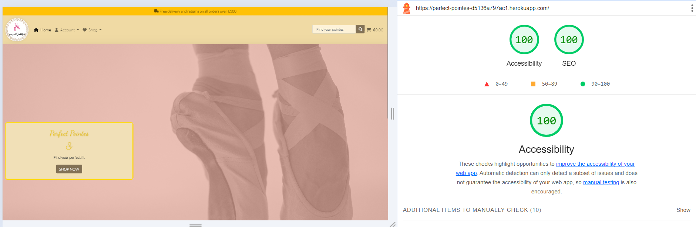

# Testing

The deployed website was tested, and the results can be found below;

## Validator Testing

[HTML Validator](https://validator.w3.org/)

Validation Results:

Home Page

Products Page 

Product Details Page

Profile Page

Bag Page

Checkout Success Page

Add Product Page

Edit Product Page

[CSS Validator](https://jigsaw.w3.org/css-validator/)

Allauth CSS

Base CSS

Checkout CSS

Profile CSS

__Validation Results:__

Python Validation was performed using the command : python3 -m flake8. No serious errors reported. 

__Python Validation Results__

[Link to PDF file of results](documentation/testing/flake8.pdf)

__JS Hint Results__

JS Countryfield

JS Stripe

__Manual Testing Test Cases and Results__

I sent the live link to friends who dance and family members for testing and feedback. The site was received positively; design and usability suggestions were considered and acted on. 

Manual testing and code validation is recorded below:

__Performance Testing__

Performance testing was conducted using Lighthouse. The results are:

Homepage

Products

Product Details

Bag

Product Management

Profile

__Stripe Testing__

__Browser Compatibility__

Browser Compatibility PASSED

Browser Compatibility checks were run using BrowserStack and my computer. The results are:

Firefox - ☑

Chrome - ☑

Opera - ☑

Microsoft Edge - ☑

Safari - ☑

__Accessibility Testing__

From using Lighthouse I was able to check the performance and accessibility of the website. 

By utilising this in DevTools I was able to generate reports for both desktop and mobile. By analysing these reports I was able to make alterations in both the HTML and CSS code to improve the accessibility of the application.

__Performance__

I compressed the images used on the website to improve the Performance score for page load.
By making these changes the current Performance rating is now 97.

__Accessibility__

I altered colour schemes of text vs. background to maximise the contrast score allowing information to be more visible to a wider group of users with accessibility issues. 

The site-wide alert was changed from #e78c77 pink to #ffc107 gold. The filter navigation on the product page was changed to a deeper brown #827155. 

The custom button was also changed to #827155. These changes helped with the contrast between page elements.

I added aria labels to enhance navigation accessibility.

I resized icons and images to make them more visible.

By making these changes the current rating is now 94.

__SEO__

Search Engine Optimisation - In Lighthouse reports the website had an average SEO rating of 100.

### Responsiveness tested

Navigation Testing

 - Mobile/Tablet Menu PASSED
 - The hamburger menu icon is visible and functions
 - Appropriate links are shown/hidden depending on user
 - All text and icons are visible and appropriate sizes
 - All navigation links successfully direct the user to corresponding pages
 - Desktop Menu PASSED
 - All links highlight and apply intended CSS
 - Appropriate links are shown/hidden depending on user
 - All text and icons are visible and appropriate sizes
 - All navigation links successfully direct the user to corresponding pages
 - Menu successfully opens and closes on press/click
 - All buttons lead to corresponding pages

### User Stories Testing

### Registration and Account Management

- US1 : Register for an account
    - Passed: As a site user I can register for an account so that I can view my profile and purchasing history.
    - Result: I can successfully regsiter for an account.

- US2 : Login and logout
    - Passed: As a site user I can easily login or logout so that I can access my personal account information.
    - Result: I can successfully login and logout of the account.

- US3 : Access user profile
    - Passed: As a site user I can access my personalised user profile so that I can view my personal order history and order confirmations and my payment information.
    - Result: I can successfully see and update my profile.

### Viewing and Navigation

- US4 : View a list of pointe shoe products
    - Passed:  As a site user there is a list of pointe shoes so that I can select some to purchase.
    - Result: There is a list of products with images, with a button to go to the product details page.

- US5 : View individual pointe shoe details
    - Passed:  As a site user I can view details for a pointe shoe so that I can see the description, brand, brand information/logo, available sizes, available widths, shank, suitability of product beginner, intermediate, advanced dancer, product colour, product feature and pricing.
    - Result: There is a product detail page for each product with lots of information about the product, a product image and the option to select the size and width of the product.

- US6 : View shopping bag total
    - Passed:  As a site user I can easily view the total of my purchases at any time to monitor my spending.
    - Result: The bag in the navbar updates with the bag total when adding products.

- US7 : Easily understand purpose of website and how to navigate
    - Passed:  As a site user I can quickly identify what the website is selling and easily navigate the pages so that I can quickly find the information and functionality of the pointe shoe product I require.
    - Result: The landing page and website name makes it clear to the user what is available to purchase. Intuitive UX to make browsing and purchasing decisions.

- US8 : View pointe shoes by category
    - Passed:  As a site user I can view a specific category of pointe shoes so that I can quickly narrow down the available shoes that I am interested in.
    - Result: Useful product categories to organise the filter of all the available products.

- US9 : View pointe shoe feature
    -   Passed:  As a site user I can view pointe shoe features so that I can easily find the shoe that is best suited to my dance level and foot shape.
    -   Result: Detailed product descriptions to give the customer useful information about the shoe.

- US10 : Handle errors 404 and 500
    - Passed:  As a site user I can continue shopping after http 404 and 500 response so that I feel I am still working within the website and can navigate easily.
    - Result: Custom error page 404 and 500 which reflect the theme and feel of the website. Continue shopping button works as expected.

### Sorting and Searching

- US11 : Sort list of available pointe shoes
    - Passed:  As a site user I can sort the list of pointe shoes products so that I can easily identify the most suitable shoe categorically sorted by colour, price, brand and category.
    -   Result: Product details page has a filter by category, price, brand and colour. I can return to all the products in the same filter menu, by selecting "All Pointe Shoes".

- US12 : Search for a pointe shoe by title or feature
    -  Passed:  As a site user I can search for a by title or pointe shoe so that I can find a specific pointe shoe to purchase.
    -  Result: Search function in the navbar functions to find useful results.

### Purchasing and Checkout

- US13 : Add items to shopping bag
    -   Passed:  As a site user I can add items to my shopping bag so that I can choose multiple items to purchase.
    -   Result: The add to bag button adds the correct number of products to the bag.

- US14 : Modify bag contents and remove items from the bag
    -   Passed: As a site user I can modify shopping bag quantities and remove items from the bag so that I can manage the contents and modify any items selected by mistake.
    -   Result: In the bag page I can edit and delete the quantity of products selected.

- US15 : View notifications of user interactions
    -   Passed: As a site user I can get notifications on screen of my actions so that I can easily understand my interactions during the purchasing process.
    -   Result: Useful notifications are displayed when adding, editing a quantity or removing a product from the bag.

- US16 : Finalise my order in the checkout page
    -   Passed: As a site user I can complete my order by going through to the checkout page so that I can see a final total, a summary of my order and I can specify a delivery address and payment details.
    -   Result: The order total is displayed correctly, the product information is displayed and the delivery and card details forms are available to complete the purchase.

- US17 : Implement a secure payment process.
    -   Passed: As a site user I can enter my payment details so that my payment is secure.
    -   Result: Tested using stripe card numbers for various possible card errors.

- US18 : View an order confirmation after checkout and repurchase button
    -   Passed: As a site user I can view an order confirmation after checkout so that I can see what was ordered and total costs. I can repurchase the product by clicking on the button which takes the user to the product detail page.
    -   Result: Checkout success details the product name, size, colour and width successfully. The price for each item and total cost is displayed. The delivery details are given and there is the option to repurchase the same product again. The repurchase button goes through to the correct product details page.

- US19 : Receive an email confirmation after checking out.
    -   Passed: As a site user I can receive an email confirmation after checking out so that I have a record of my purchases.
    -   Result: I can see an email after purchase confirming my order.

### Admin and Store Management

- US20 : Add a pointe shoe
    - Passed: As a site admin I can add a pointe shoe so that I can sell new products.
    -   Result: Successful in adding a pointe shoe product.

- US21 : Edit / update a pointe shoe
    -   Passed: As a site admin I can edit / update details for a pointe shoe so that I can change or amend the title, image, brand, colour, size, width, availability, status and features.
    -   Result: Successful in editing a pointe shoe product.

- US22 : Delete a pointe shoe
    -   Passed: As a site admin I can delete a product so that I can remove the item for sale.
    -   Result: Successful in deleting a pointe shoe product.

### SEO and Web Marketing

- US23 : Subscribe to newsletter
    -   Passed: As a site user I can subscribe to the company newsletter so that I can keep up with company news and offers.
    -   Result: Successful in entering customer details in order to receive a newsletter. I receive a success message to confirm submission.

- US24 : View company facebook page
    -   Passed: As a site user I can find the company on facebook so that I can keep up to date with company posts.
    -   Result: There is a Facebook page for the company with a link in the footer.

- US25 : View privacy policy
    -   Passed: As a site user I can view the company privacy policy so that I can see the company is GDPR compliant.
    -   Result: The GDPR privacy policy is available on the footer of all the website's pages.

__Debugging and Known bugs__

Remove a Pointe Shoe product from bag: URL repeatedly not found, slack channel provided the answer to the JavaScript URL and view URL, which needed an additional /bag/ added to rectify this issue.

PointeShoe Form: The form needed to be able to get data from the pointe shoe model and the pointe shoe product model. So that new data could be entered into the form, it was necessary to get the data and post the cleaned data. A thread in copyprogramming.com helped me to fix this (see credits).

Checkout Success: This view returned the pointe shoe with all the available sizes, widths and colours in the checkout confirmation. In the end I managed to get the actual size, width and colour of the shoe purchased to display in the view.

Product Page Back to top button not working. I tried to research and update this functionality, I found a code snippet in W3C schools, "How make a JS button" solved this problem for me (see credits).

Website Logo, Favicon and landing page image were not available throughout the website using the media URL, despite adding the context processor 'django.template.context_processors.media', into the settings.py file.  I added an image folder to my static folder to contain these images instead and added the tag  . Thanks to my mentor Brian this was easily rectified.

Loading products from SQLite to Heroku Postgres: As my products were added through the django admin site when deploying the website to Heroku my product database was not there. Thanks to the slack channel and the guide on Transferring SQLite to Heroku Postgres I was able to solve this problem. 
[Code Institute Slack Channel](https://code-institute-room.slack.com/files/UPDFEU62U/F02SZ5T16HG/transferring_database_data_from_sqlite_to_heroku_postgres.pdf) 

Profile Page working in production but not in the deployed project. I had to save the default profile fields exactly as the elephant SQL table to make the data save correctly. Thanks also to Student Support for finding the error 400 on the profile page, as there was an extra "/" in the script causing the problem.

Email Error 500, thanks again to Student Support who helped resolve the problem with the checkout success which was not triggering an email confirmation. It was necessary to add a runtime.txt file to resolve this problem.

No known bugs were noted.

[Link to README.md](README.md)

[Link to Marketing and SEO README.md](SEO_MKTG_README.md)
